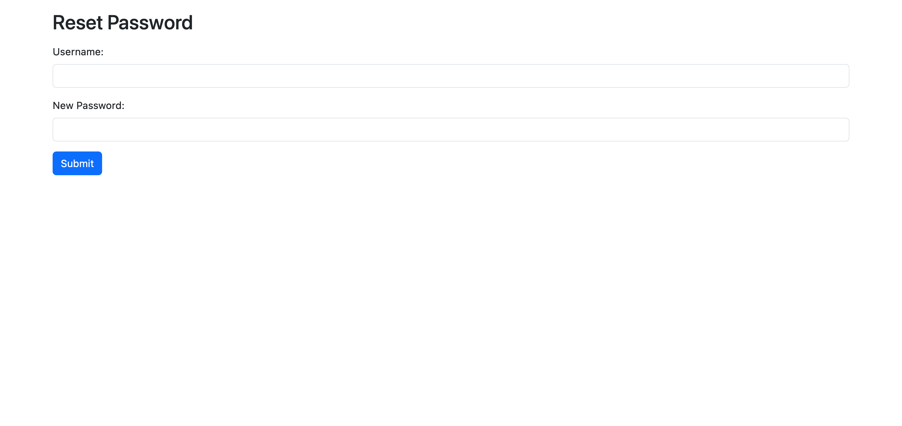
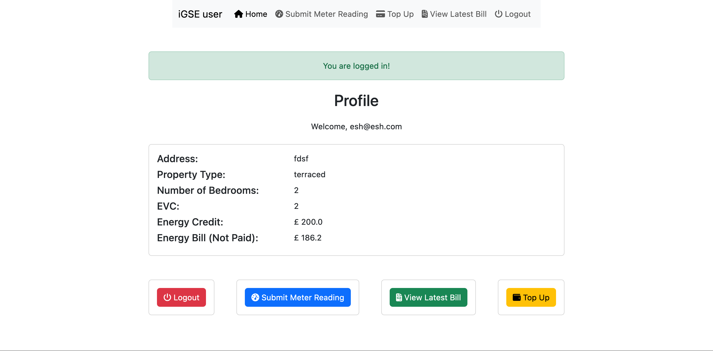
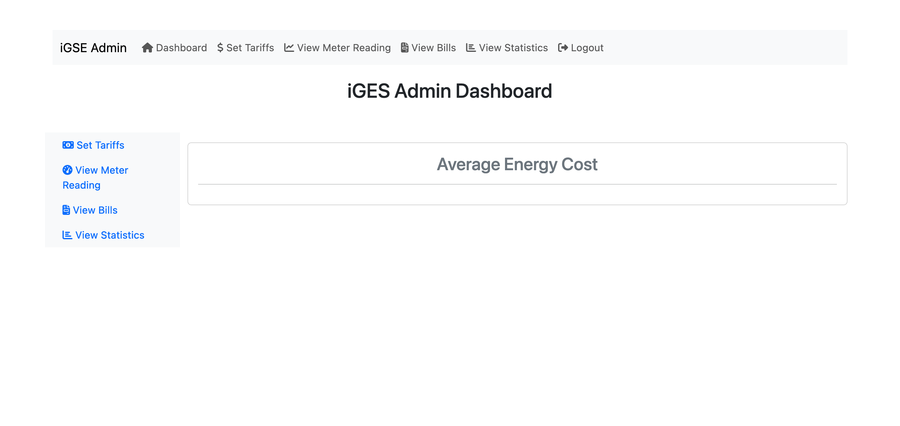
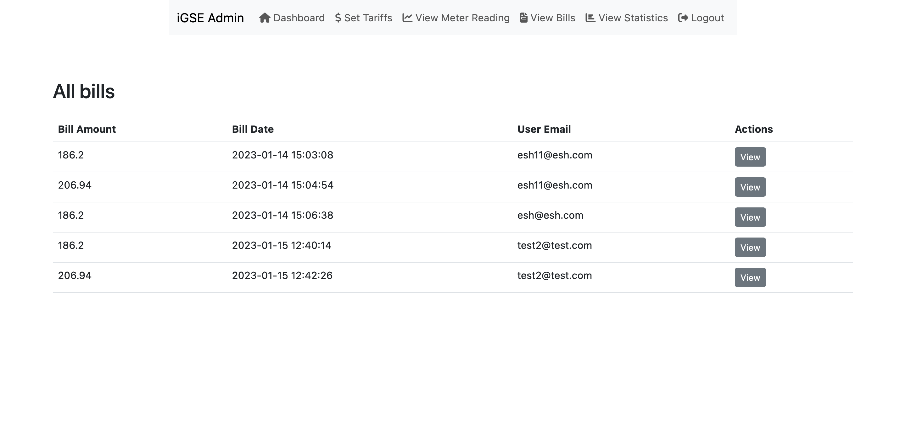
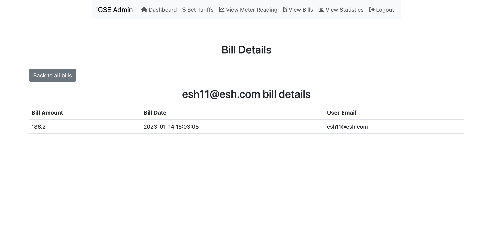
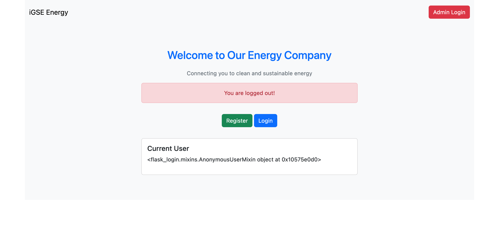

# Introduction

In this section, it's all about system screenshots. I will list down all the screenshots of the webapp webpages.

## Table of Contents

- [Introduction](#introduction)
- [Table of Contents](#table-of-contents)
- [:unlock: Open webpages](#open-webpages)

  - [Home Page](#home-page)
  - [Login Page](#login-page)
  - [Register Page](#register-page)
  - [Reset Password Page](#reset-password-page)

- [:closed_lock_with_key: Authenticated webpages (normal users)](#authenticated-webpages-normal-users)

  - [Dashboard Page](#dashboard-page)
  - [Submit Meter Reading Page](#submit-meter-reading-page)
  - [View Last Bill Page](#view-last-bill-page)
  - [Top-up Account Page](#top-up-account-page)

- [:closed_lock_with_key: Authenticated webpages (admin users)](#authenticated-webpages-admin-users)

  - [Admin Dashboard Page](#admin-dashboard-page)
  - [Set/Update Tariff Page](#setupdate-tariff-page)
  - [View All meter readings Page](#view-all-meter-readings-page)
  - [View All Bills Page](#view-all-bills-page)
  - [View Single Bill Page](#view-single-bill-page)

- [:closed_lock_with_key: Auth Webpage (normal & admin users)](#authenticated-webpages-normal--admin-users)
  - [Logout Page](#logout-page)

## Open webpages

Home Page

## Home Page

<b>Home Page</b>
On the homepage, if user is anonymous, it will show session information and a login button. If user is logged in, it will show the user's information and a logout button.

Login Page

## Login Page

<b>Login Page</b>
A page only accessible to anonymous users. It's a simple form which has instant AJAX validation.

Register Page

## Register Page

<b>Register Page</b>
A register page for new users to register into the system. It's a simple form which has instant AJAX validation.

It has features like:

- The interesting part is, if you select the "Enter Voucher Code" input field and click on "Scan QR Code" button and scan the QR code, the voucher code will be automatically filled in the input field. This is done using the [QR Code Scanner](https://cdn.jsdelivr.net/npm/jsqr@1.0.4/dist/jsQR.min.js).

- Check if the voucher code is valid instantly using AJAX.
- Check if the username is available instantly using AJAX.

Reset Password Page

## Reset Password Page

<b>Reset Password Page</b>
A page for users to reset their password.

## Authenticated webpages (normal users)

Dashboard Page

## Dashboard Page

<b>Dashboard Page</b>
A dashboard page for users to view their information and their vouchers. It also has a button, submit meter reading,view last bill, top-up account, and logout.

Submit Meter Reading Page

## Submit Meter Reading Page

<b>Submit Meter Reading Page</b>
A page for users to submit their meter reading. It has a form which has instant AJAX validation.

View Last Bill Page

## View Last Bill Page

<b>View Last Bill Page</b>
A page for users to view their last bill. It has a table which shows the last bill information.

An action button, Pay, is also available for users to pay their last bill.

Top-up Account Page

## Top-up Account Page

<b>Top-up Account Page</b>
A page for users to top-up their account.

It has features like:

- Scan QR Code to fill in the voucher code automatically into the input field (same as register page)

- Validate voucher code instantly using AJAX.

## Authenticated webpages (admin users)

Admin Dashboard Page

## Admin Dashboard Page

<b>Admin Dashboard Page</b>
A dashboard page for admin users to view their information and their vouchers. It also has a button, submit meter reading,view last bill, top-up account, and logout.

Set/Update Tariff Page

## Set/Update Tariff Page

<b>Set/Update Tariff Page</b>
A page for admin users to set/update tariff.

View All meter readings Page

## View All meter readings Page

<b>View All meter readings Page</b>
A page for admin users to view all meter readings submitted by users.

View All Bills Page

## View All Bills Page

<b>View All Bills Page</b>
A page for admin users to view all bills generated by the system.

View Single Bill Page

## View Single Bill Page

<b>View Single Bill Page</b>
A page for admin users to view a single bill.

View statistics Page

## View statistics Page

<b>View statistics Page</b>
A page for admin users to view statistics of the system.

## Authenticated webpages (normal & admin users)

Logout Page

## Logout Page

<b>Logout Page</b>
A page for users to logout of their account.

